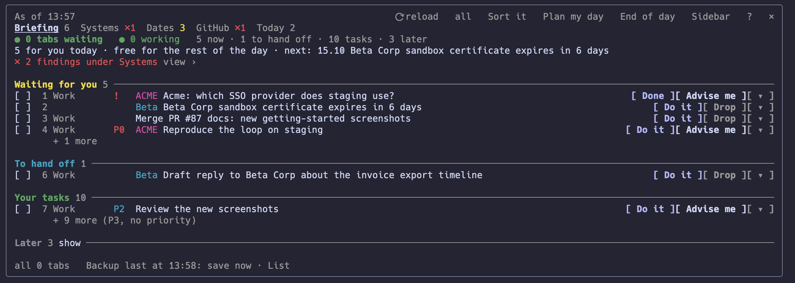
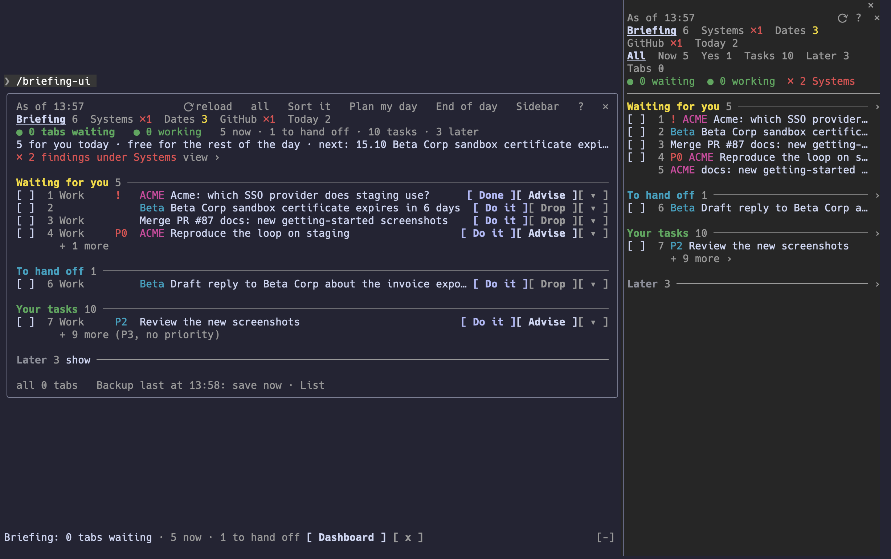
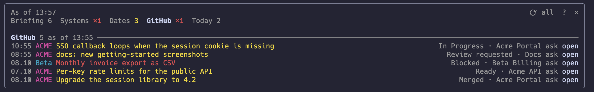

# The briefing dashboard: setting it up

The briefing (`/briefing`, [`briefings.md`](briefings.md)) is text the agent
reads to you. The dashboard shows the same result as a card you click: what
waits for you, what you can hand off, your tasks, and tabs beside it for
whatever else your briefing collects (health checks, dates, GitHub, today's
commits, your inbox). Nothing on it costs tokens until you press a button that
asks Claude or opens an agent tab.

**Status.** Tested with Claude Code and cmux only. It is a Claude Code mod
(function hooks, early access); other agents cannot load it. Without cmux
everything works except the agent tabs: no tab line, no Yes and No for a
waiting tab, no layout backup.

## 1. Install the mod

You need:

- an onboarded Bridge: `bridge-config.yaml` in the repo root, written by
  `/bridge-onboard`;
- Claude Code 2.1.291 or newer (`claude --version`);
- `python3` with PyYAML (`python3 -c 'import yaml'` prints nothing): the mod
  reads `bridge-config.yaml` and runs the Bridge scripts through it.

Start Claude Code in the repo root, not a subfolder, because the mod checks
the current folder.

The mod ships with open-bridge under `mods/briefing-ui`, published through the
folder marketplace `open-bridge-mods` in `mods/` ([`mods/README.md`](../mods/README.md)).
From the Bridge folder:

```bash
claude plugin marketplace add ./mods --scope local
claude plugin install briefing-ui@open-bridge-mods --scope local
```

`--scope local` keeps both to this Bridge (they land in
`.claude/settings.local.json`, which git ignores). The mod only acts in a folder
that holds `bridge-config.yaml` and `scripts/briefing.py`. Claude Code reads the
mod straight from `mods/briefing-ui` (`claude plugin list` shows "Read from").
After a pull or an edit, start a new session or run `/reload-plugins`. If
`claude plugin list` shows no "Read from" line, your Claude Code keeps a copy:
then run `claude plugin update briefing-ui@open-bridge-mods --scope local`
first.

## 2. Switch it on

In `bridge-config.yaml` (yours, written by onboarding, never committed upstream),
add `claude_code_ui` under the `briefing:` block you already have:

```yaml
briefing:
  # ... your existing briefing keys stay as they are
  claude_code_ui:
    enabled: true
```

Do not add a second top-level `briefing:` key: YAML keeps only the last one,
so it silently replaces the first and its settings are gone.

Start a new Claude Code session in the Bridge folder and type `/briefing-ui`.
The card appears in the conversation; `Sidebar` (German: `Leiste`) opens it as
a side panel.



The same card with the side panel open, and the band above the prompt at the bottom
(all data in these pictures is invented):



Every other key is optional; `bridge-config.yaml.template` lists them all with
their defaults:

| Key | Default | What it does |
|---|---|---|
| `surface` | `chat` | `chat`: a card in the conversation, `pane`: the side panel |
| `band` | `true` | one line above the prompt: waiting tabs, what is due now |
| `shortcuts` | `true` | type `3a` or `1a 4v` to act on numbered rows without asking Claude (letters below) |
| `morning_hint` | `true` | the first session of the day points at the briefing |
| `language` | from `language.conversation`, else `en` | `de` or `en` for the dashboard's own words |
| `full_minutes` | `10` | on open, run the full briefing again when the last is older |
| `status_seconds` | `60` | how often, in seconds, the agent tabs are re-read (cmux only); a value below 15 counts as 15 |
| `voice` | `false` | a waiting tab is also spoken (macOS) |
| `snapshot_minutes` | `60` | back up the cmux layout while a session inside cmux is open; `0` = never |
| `launch.target` | `area` | where "Do it" opens a tab: `area`, `tab`, `workspace` or `auto` |

The dashboard's default target is `area` (the workspace of the item's area),
while `workplace.py launch` on its own defaults to `tab` (the calling tab's
workspace).

Shortcut letters, after the row number as it stands on the card: `a` Do it,
`b` Later (tomorrow), `c` Drop (an inbox entry is dropped, any other row is
hidden for a week), `v` Advise me, `w` Do it in its own workspace. Shortcuts
work only while today's card is open in this session and shows the Briefing
tab; otherwise the text goes to Claude as an ordinary message.
`/briefing-ui-off` hides the line above the prompt for this session;
`/briefing-ui` still opens the dashboard.

Do it on an inbox entry that waits for your yes to run an action approves it;
nothing runs at once. The action runs at the next `python3 scripts/inbox.py run` on the
machine named in `inbox.runner` ([`inbox.md`](inbox.md)). Any other row gets
an agent tab (section 4).

## 3. Build your briefing profile

What the card and its tabs show comes from your briefing profile,
`workflow/briefings/<id>.yaml`. The dashboard shows the default profile: the
one `briefing.default` in `bridge-config.yaml` names, else the one with
`default: true`, else the only one there is. The card is built from the
profile's view, so the profile needs a `view.style` other than `sources`
(the template uses `triage`).

Without a profile of your own the built-in one runs (inbox, advice, tasks,
calendar, activity, and the trackers you enabled). It has no view, so the
dashboard asks for the triage view itself: the card shows your inbox, the
advice and your tasks, the calendar and the activity sit on their tabs. That
is enough to try the dashboard; for your own sources, tabs and marks, copy
the template:

```bash
cp workflow/briefings/_template.yaml workflow/briefings/morning.yaml
python3 scripts/briefing.py validate          # names every problem
python3 scripts/briefing.py collect --json    # what the dashboard receives
```

Edit `for:` and the `owners:` of the `github-mine` section (your GitHub org or
user) before you collect, or delete that section if you do not use GitHub.
Otherwise it answers without error and stays empty.

Each section is one source: the inbox, your tasks, a calendar, a tracker
(GitHub, GitLab, Jira, Azure DevOps, Linear), today's commits, or any
program of your own that prints JSON (`kind: command`). The kinds and their
keys are in [`briefings.md`](briefings.md).

### Tabs and columns



Without `view.pages` the kind decides the tab: `command` sections (your own
probes) on Status, calendars on Dates, trackers on Trackers, commits and
activity on Today, inbox, advice and tasks on the briefing itself, any other
kind on More. To choose yourself, merge these keys into
the `view:` block your profile already has, and add the two sections the
template leaves commented out:

```yaml
view:
  pages:
    - id: github
      title: GitHub
      sections: [github-mine]                  # the template's tracker section
    - id: today
      title: Today
      sections:
        - calendar                             # a section without id: its kind
        - commits
        - {id: activity, badge: false}
    - id: systems
      title: Systems
      sections:
        - {id: probes, alarm: true, empty: "all green"}

sections:
  # ... the template's sections, then:
  - kind: commits
    days: 7
  - kind: command                              # any program printing JSON items
    id: probes
    title: "Probes"
    argv: ["python3", "tools/probes.py"]
```

A page names sections by id; `validate` says which id it cannot find.

Every row has the same columns: when, title, detail, link. A page entry
overrides them per section (`when`, `detail`, `link` name an item field),
`empty` is the text for nothing (default "nothing"), `alarm: true` turns
every row into a red finding and nothing more, `badge: false` keeps a section
out of the number on its tab.

### Marks for customers and projects

```yaml
view:
  marks:
    - {label: ACME, match: [acme, acme-portal], color: magenta}
    - {label: Beta, match: beta-corp, color: cyan}
```

A row whose title, id, project, repo, task, context, area, labels or url (its
link) contains one of the words gets the label in front, on the card, on the tabs and in the text
briefing. The first mark that fits wins. Customers change; keep them here.

### Fast despite slow sources

A tracker can take 20 seconds. `cache_minutes` on a section reuses its last
good answer for that long, and the section then says how old it is
("as of 08:46"):

```yaml
sections:
  - kind: tracker
    id: github-mine
    provider: github
    query: {assignee: "@me", kinds: [issues, prs]}
    cache_minutes: 5
```

`⟳ reload` (German: `⟳ neu`) on the dashboard always asks every source fresh. A failure is never kept,
and nothing cached crosses midnight.

### Words

The dashboard's own buttons and help come in German and English. The
briefing's words (headline, tab names, "today") are yours: set them in
`view.labels`, for example `labels: {page_status: Systeme, today: heute}`.

## 4. Agent tabs (optional, cmux)

With cmux, "Do it" and "Advise me" open an agent tab per task, the card shows
which tabs wait for you, and a tab that asks for permission gets Yes and No
buttons. That needs three things:

1. cmux installed;
2. Claude Code started inside a cmux tab;
3. the cmux driver in the `workplace:` block of `bridge-config.yaml`
   ([`workplace.md`](workplace.md)):

```yaml
workplace:
  driver: {command: ["python3", "${root}/skills/cmux/scripts/cmux_driver.py"]}
  control: {name: Control}
```

Without the driver, Do it and Advise me open nothing: the note at the bottom
of the card lists the commands to start by hand, one terminal each.

`workplace.control.name` names a workspace: the workspace whose session steers
the others. The dashboard in that session polls the agent tabs and notifies;
the dashboards in other sessions read its state quietly.

## 5. When something is off

| You see | Why, and what to do |
|---|---|
| `/briefing-ui` says it is off | `briefing.claude_code_ui.enabled` is not `true`, or `scripts/briefing.py` is missing in this folder |
| `/briefing-ui` says it could not read `bridge-config.yaml` | the file has a YAML error, or `python3` lacks PyYAML; the reason follows the message |
| `/briefing-ui` is an unknown command | the session does not run in the Bridge root, or the mod is not installed or enabled for this project (`claude plugin list`) |
| "Nothing waits for you" and empty tabs | the profile has no sections for it; run `python3 scripts/briefing.py collect --json` and look at `pages` |
| a tracker tab is empty but not failing | check its `query` (`owners`, `repos`): the template's placeholders find nothing |
| a section reads "could not read: …" | its source failed; the reason follows (a token, a timeout); fix the source, then ⟳ |
| a tab lags behind | it is cached (`as of …`); ⟳ asks fresh |
| the tab line says the tab state is stale | `workplace.py status` failed; the reason is shown in red |
| a change to the mod shows no effect | start a new session or run `/reload-plugins`; only if `claude plugin list` shows no "Read from" line, run `claude plugin update briefing-ui@open-bridge-mods --scope local` first |
